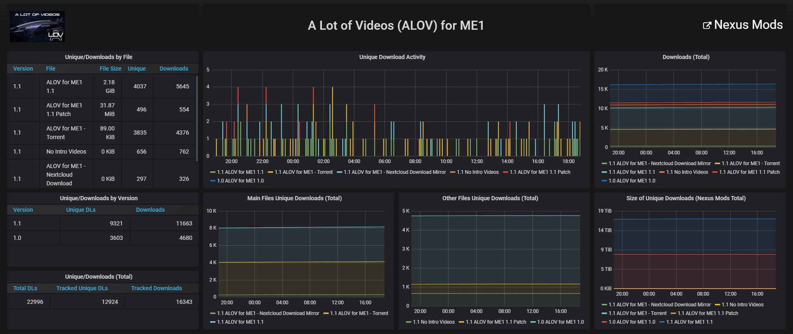
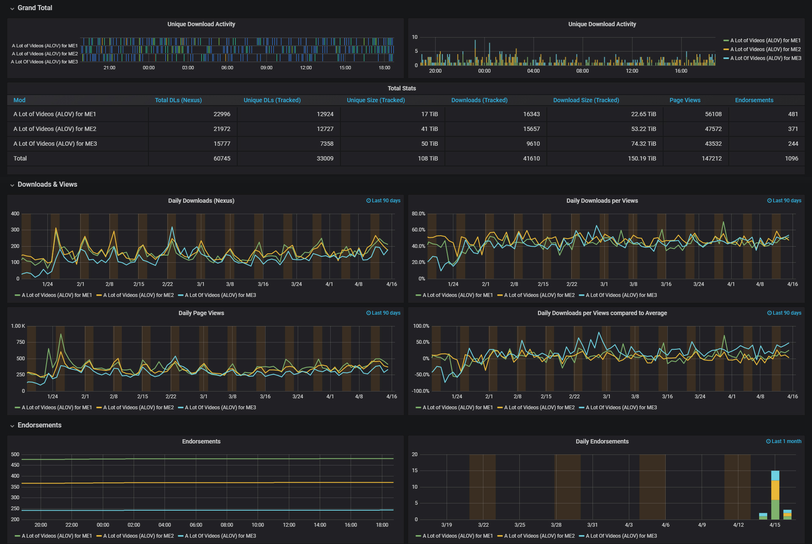

# Nexus Mods Stats

Collects and tracks various stats of your Nexus Mods mods.

## Contents
1. [Installation](#installation)
1. [Usage](#usage)
1. [Docker Usage](#docker-usage)
1. [Constributing](#contributing)
1. [Screenshots](#screenshots)

## Installation

1. `git clone` this repository to your server.
1. Install dependencies: `pip install toml`. Consider using a [virtual environment](https://docs.python.org/3/tutorial/venv.html).
    - for Prometheus: `pip install prometheus_client`
    - for TimescaleDB: install the PostgreSQL development package (e.g. `libpq-dev` on Debian/Ubuntu, `libpqxx-devel` on Fedora) and `pip install psycopg2`
1. Copy `config.toml.example` to `config.toml`. Modify it to your needs and list the games and mods you want to track. Read the comments for more information on how to format your settings.
1. Get an API key from https://www.nexusmods.com/users/myaccount?tab=api and save it to your `config.toml`. Take care that nobody but you can access your API key!

## Usage

To print stats to stdout once (e.g. testing your setup), run `./crawler.py`, or pipe to file: `./crawler.py > crawler.out`.

To export metrics to [Prometheus](https://prometheus.io):
1. [Install Prometheus](https://prometheus.io/docs/prometheus/latest/installation/)
1. Run `./prometheus_exporter.py` as a daemon.
1. Set Prometheus to scrape from the running script (default `localhost:8000`) with scrape interval matching the script's `"min update interval"`.

To export metrics to [TimescaleDB](https://www.timescale.com/):
1. [Install PostgreSQL + TimescaleDB](https://docs.timescale.com/latest/getting-started/installation)
1. Depending on your setup, enable network-based access: `listen_addresses` in `postgresql.conf`, authentication in `pg_hba.conf`.
1. Set up a user, password, and database ([instructions](https://medium.com/coding-blocks/creating-user-database-and-adding-access-on-postgresql-8bfcd2f4a91e)). Add this configuration to your `config.toml`.
1. Run `./timescale_exporter.py` as a daemon.

To display metrics with [Grafana](https://grafana.com/):
1. Set up your Grafana dashboards using the provided Prometheus metrics and labels (name, version, category), or PostgreSQL tables and columns. Find more info and examples in the [documentation](documentation) folder.
1. The TimescaleDB example dashboard requires some community plugins: `grafana-cli plugins install aidanmountford-html-panel`
 
## Docker Usage

## Contributing

Feel free to PR!

## Screenshots

